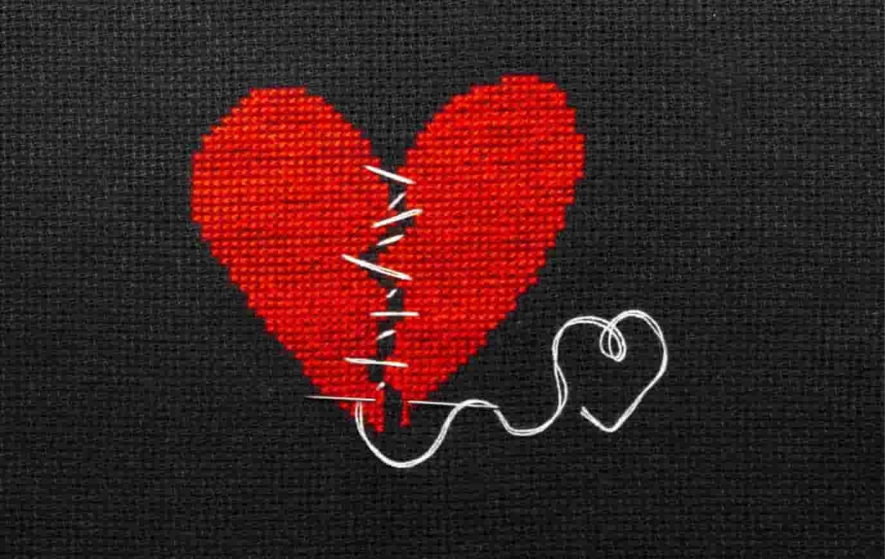

A myth, relationship means a relation where 2 people love each other and can do anything. Can do anything, really? Actually, relationship is a ship which take friendship to another level when they feel attracted towards each other. 95% relationship are form only on the basis of attraction and how much close you are. Relationship have some basic roots:
1. Trust: Even after trusting completely there is something which pinches the couple to ask and spy on their partner 
2. Understanding: Only for showing purpose, actually pair knows how to clear their doubt without letting their partner know about it
3. Loyalty: Couples **TRY** to be loyal
4. Promise: Couples promise each other a bunch of things like, ***they’ll share each and everything*** every couple falls in this trap, couple try to share everything but after watching their partner reaction they try to hide thinking that they are saving relationship that’s a myth as they are actually ruining it by breaking promise.

>Everyone should understand one thing, it’s good to focus for happy **we** but not by forgetting **me**.

#### Usual Relationship cycle:

Two people fall in love (actually attraction) come in relationship and shared their taken status to everyone. Now the show starts, they share their lovely happy relation pictures and videos on the social platform and starts meeting each other’s best friend, normal friend, ex, close friends and then jealousy starts, girl  started getting jealous to guy’s ex and close female friends and guy started getting jealous to girl’s ex and close male friends. Initially they don’t act much they try to calm themselves but for limited time, they start sharing their jealousy phase to their friends before sharing to their partner (**1st mistake**) then they start taunting when their partner meets “close friend”. 

The couple who come up with this jealous and taunting phase can deal with further problems. But the couple who can’t clear this phase end up crying and pointing mistakes. No one can tolerate such harsh phase and they end up with breakup. Now the friends who know about relationship wants to know about their breakup reason, they give the reason in which they clear their image and conclude that the relationship was a mistake and the biggest mistake was their partner for maintaining their fake nature and impression, so no one can judge them or point them and for maintaining their social life they post some breakup sad quotes for taunting their partner. 

Out of those relationship who survive the jealous and taunting phase some end up because of judgement passed by their friends and according to them they don’t deserve each other ***they deserve better***, why everyone thinks that better is perfect then good? People who judge the couples for an awesome kick in their life or because some personal grudges, are one who can’t see anyone happy. Some couples end up because the attraction diminished and didn’t transform into love. Few couples survive till the end of their life. 

#### Types!!!

According to youngster there are three types of relationship long distance, short distance and living in relationship that’s not so true. Actually, there are many types of relationship like relation between mom and son, dad and daughter, friendship, love relationship etc and under love relationship there are 3 types of relationship: 

 1.	Stable
 2.	Unstable
 3.	Mixed

In stable, couples actually understand the situation and act in accordance to explain their point without thinking about others and these type of couples actually know how to communicate well.

In unstable, couples never try to understand the situation and act according to their wish and fight and say many harsh terms to each other and finally breakup. 

In mixed, couples try to understand if they agree with one point they’ll never fight and if they don’t on any point they act to understand because they want to save and they think about what people will think if they raise any point. 

It’s impossible that everyone can understand all the point and you can clear anything only by communicating. 

#### Difference between like, love and attraction

A person like anyone when they see anyone’s good side, which is temporary. No one can act good; everyone has a bad side.

A person attracts to person on the basis of way of talking and understanding level and people term that as nature. In short, they attract to person’s so-called nature. Nature never changes, still attraction diminishes. 

A person love someone when they see anyone’s good side and bad side and still like them. That’s actually loving the nature, that’s permanent and never changes.

Knowing the difference is important because that saves time, feelings and help to save the bond , else only attraction or like without any change leads to breakup.  

#### Types of breakup

Breakup requires lots of reason but relationship doesn’t, to convince ourselves, our partner and other people. Reason can be true, can be fake or can be an imagination like “parents won’t agree on their relationship”, why couple want to give reason can’t they give a second chance or third or xyz no. of chance? Why they think they can’t agree their parents? Why they want other people to understand the reason? Without discussing much they just give statements and these statements differs from person to person. They modify their reason by judging the understanding level of another person. They end up with breakup but deep down they think about their ex if they literally liked or loved the person. 

There are two types of breakup.
1.	One sided commonly known as “***katwana***” 
2.	Mutual (not so common)

Some precious word by *GULZAR SAHEB*:

>***“Dil bhale hi kisine bhi toda ho, Par alag hone k baad roye dono the….”***

***Breakup is not always the last option, if you think it is then rethink…….***

